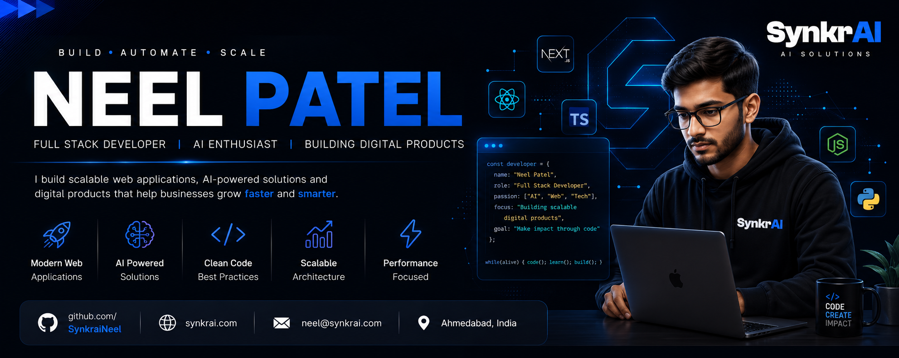

<!-- Banner -->

  

<!-- Hero -->
<h1 align="center">👋 Hi, I'm Neel Patel</h1>

<h3 align="center">
  Full Stack Developer 
  AI Engineer 
  Next.js Developer 
  Building AI Products at <a href="https://synkrai.com">SynkrAI</a>
</h3>

  

  
  
  

---

# 💫 About Me

**💼 Current Role**

Full Stack Developer @ [**SynkrAI**](https://synkrai.com)

**🚀 Building**

- SaaS Products
- AI Platforms
- Marketing Solutions

**📚 Currently Learning**

- AI Agents
- LangChain
- MCP
- RAG
- LLM Applications

**🎯 Interests**

- Next.js
- React
- UI/UX
- SEO
- Performance

🤝 Always open to collaboration on interesting projects.

---

# 🚀 Featured Projects

### 🚀 PeakPilot

D2C Ecommerce Marketing Platform focused on SEO, Performance & Conversion.

**Tech:** Next.js • React • Tailwind • GSAP

  
  

---

### 🤖 SynkrAI

AI Platform for Business Automation & Productivity.

**Tech:** Next.js • AI • TypeScript

  
  

---

### 🏢 Quartile

Enterprise Dashboard & Admin Panel.

**Tech:** Next.js • TypeScript

  
  

---

### 🏠 Ash Buyers Agency

Luxury Buyers Agency Website.

**Tech:** Next.js • SEO

  
  

---

### 🎓 SynkrAI Academy

AI Learning Platform.

**Tech:** React • Next.js

  
  

---

# 💻 Tech Stack

**Frontend**

  

**Backend**

  

**Database**

  

**Cloud & DevOps**

  

**Tools**

  

---

# 📈 GitHub Statistics

  
  

---

# 🔥 GitHub Streak

  

---

# 📊 Contribution Graph

  

---

# 🐍 Contribution Snake

  

---

# 🎯 Current Focus

**🚀 Currently Building**

- 🤖 AI Automation Platform
- 🛒 Ecommerce Marketing Suite
- 📊 SEO Dashboard
- ⚙️ Internal AI Tools
- 🌐 Enterprise Web Applications

---

# 🏅 GitHub Profile

  

---

# 🌐 Connect With Me

  
  
  
  

---

# 📌 Quote

> *"Code with purpose. Build products that solve real problems."*

---

  ━━━━━━━━━━━━━━━━━━━━  
  ⭐ Thanks for visiting!  
  Let's build something amazing together.  
  ━━━━━━━━━━━━━━━━━━━━

